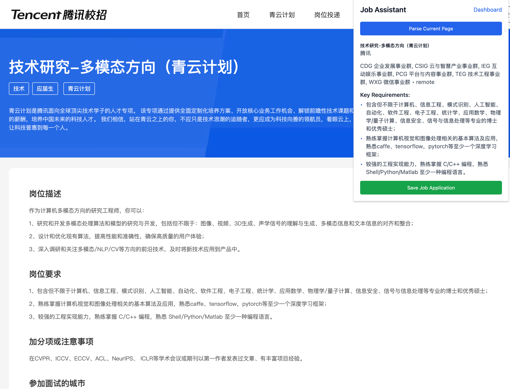
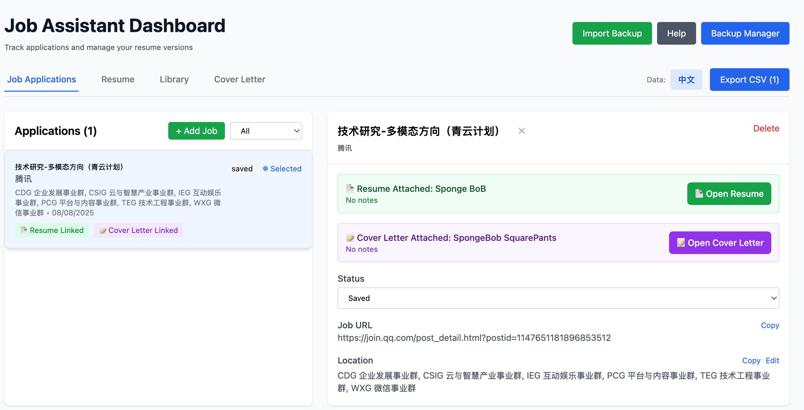
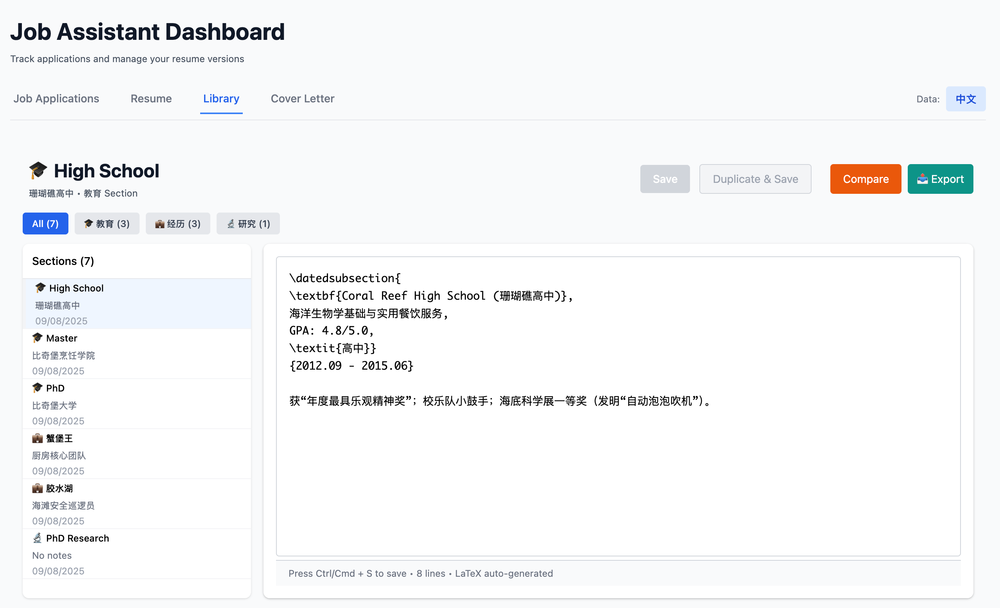
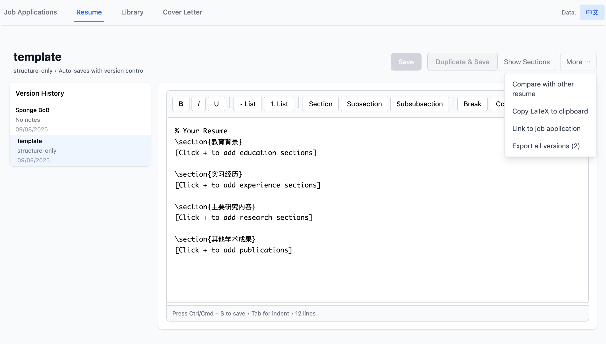
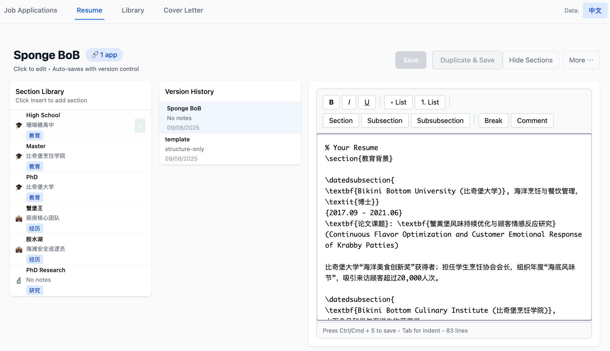
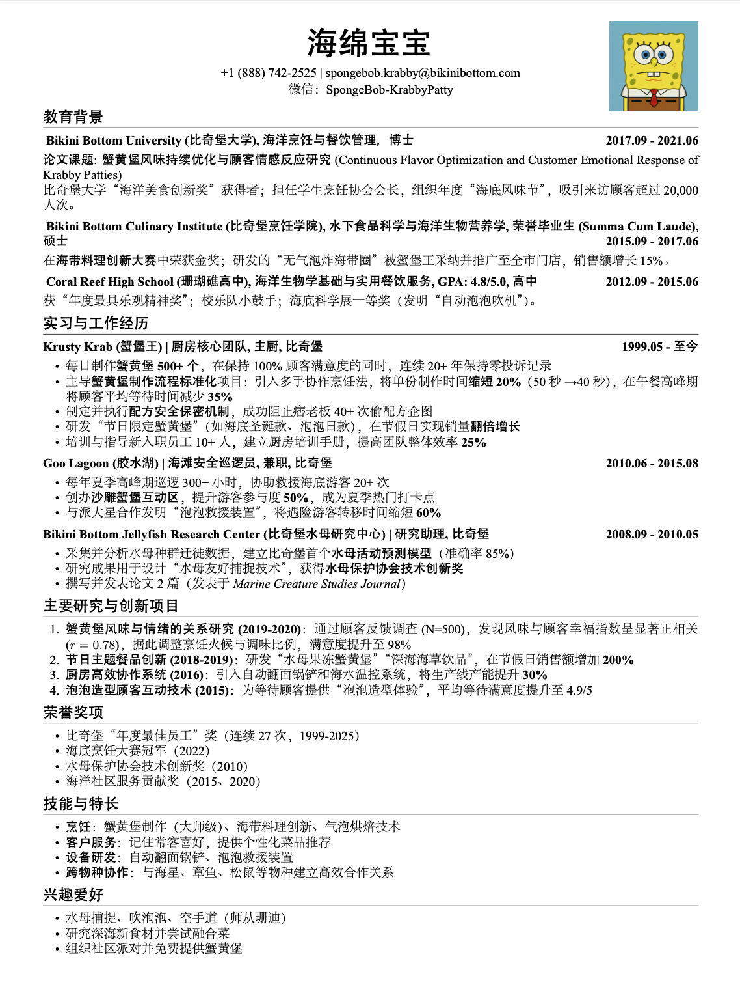
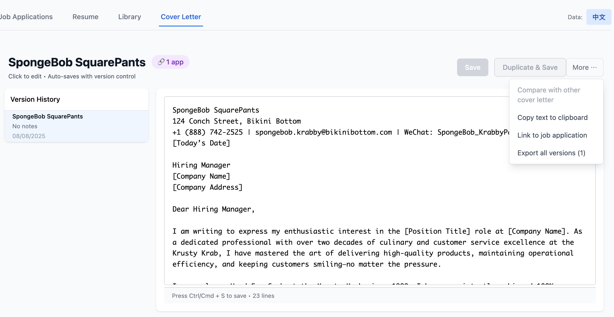

# Job Application Assistant

[中文文档](./README_CN.md) | English Documentation

A Chrome extension that manages the job application workflow.

## The problem I was trying to solve

During my job search, I was interested in careers spanning multiple industries, and each company had different specific requirements. To increase the probability of my resume and cover letter (CV) passing through automated screening systems (i.e., modifying content to match keywords the target company might filter for), I needed to prepare different versions of resumes and CVs for different positions.

This process created several problems:
- Many versions of resumes and CVs scattered everywhere (Resume_v1.pdf, Resume_v2.pdf, Resume_recent.pdf...); tracking these resumes and CVs with their corresponding job applications became difficult, causing trouble for subsequent interview processes
- When preparing new resumes and CVs, the editing process was tedious, requiring copying to new versions and switching between various versions to find reusable materials
- My applications were in Chinese/English, requiring separate version management

Therefore, I needed something that could:
- Integrate job information, centrally manage resumes and CVs, and support version comparison
- Quickly find reusable materials when editing new versions
- Support separate Chinese and English management
- Keep data stored locally (for privacy reasons)

This extension satisfies all my requirements above. Later, I plan to develop interview management based on my needs, hoping to connect all the databases together to make my job search process smoother.

## Demonstrations

### Step 1: Parse Job Information
On a job description page, click `Parse Current Page`. The extension will automatically parse the job description and save it as a job application.

**Note**: Automatic parsing requires LLMs, but you can also choose to add manually.

### Step 2: Enter Management Dashboard
After saving, enter the Dashboard to begin the job application management workflow. Chinese and English databases can be switched by clicking the icon in the top-right corner.

### Step 3: Create Experience Modules
Click open Library to create past experiences, preparing content for your resume. All materials are centrally managed here.

### Step 4: Assemble Resume
After preparing all experiences, go to the Resume page and directly insert corresponding sections to create your resume.

You can flexibly combine different experience modules to adapt to different types of position requirements.

### Step 5: PDF Generation
Currently uses a fixed LaTeX template to generate professionally formatted PDF resumes.

### Step 6: Cover Letter
Cover letter operations follow similar logic, also supporting modular management.

### Version Tracking
Both resumes and cover letters can be directly linked to applications for convenient version tracking. You'll always know which version you sent to which company.

### Data Management
All data is stored locally. Data under each tab can be saved individually, and the entire dashboard's data can be imported/exported, making it convenient for future migration to other projects.

## Technical bits

React + TypeScript + Chrome Extension API. Local browser storage only, privacy-free except for optional OpenAI calls. Includes a LaTeX editor for proper resume formatting.

## Getting it running

This is a development extension, so installation requires a few manual steps. I've included helper scripts to simplify the process:

**Automatic setup**:
1. Download from [releases](https://github.com/RayStx/job-application-assistant/releases) and extract
2. Run the install script (`install.bat` on Windows, or `./install.sh` on Mac/Linux)
3. The script opens Chrome's extension page
4. Enable "Developer mode" and click "Load unpacked"
5. Select the extension folder

**Manual setup**: Go to `chrome://extensions/`, enable developer mode, load unpacked extension.

**Getting started**: 
- First run: Click the extension icon to optionally add an OpenAI API key for job parsing
- **Examples included**: The release contains example resume templates and database templates to help you get started quickly

## Project Background

All functionality development is based on my own needs, hoping to help others along the way.

The project code is basically all generated by Claude-code.

The deliverables are very basic in quality. If there are already better tools on the market, please recommend them to me.

My ideal job involves full-cycle AI product development (1. User research; 2. Product implementation; 3. Impact evaluation). If you have any position recommendations, I would be deeply grateful.

---

**Code**: https://github.com/RayStx/job-application-assistant  
**Issues**: https://github.com/RayStx/job-application-assistant/issues