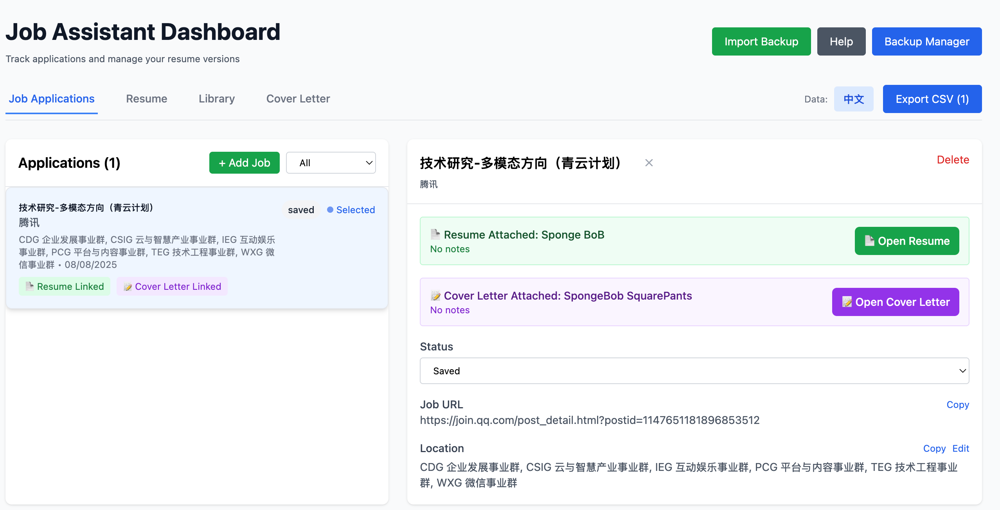
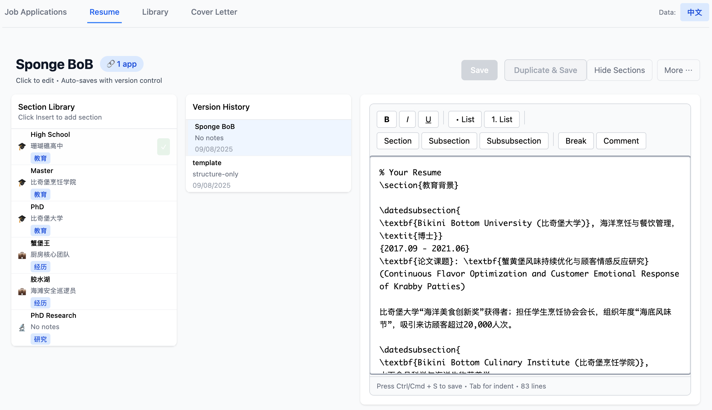
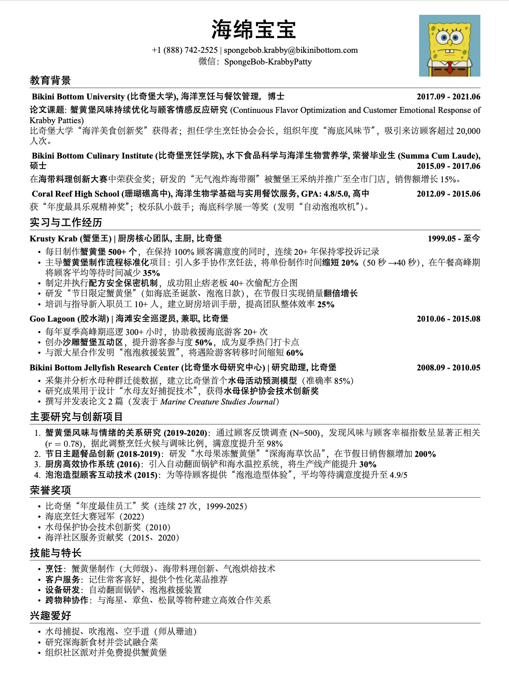

# Job Application Assistant (求职申请助手)

[English Documentation](./README.md) | 中文文档

一个管理求职申请流程的Chrome扩展。

## 我遇到的问题

在我找工作的过程中，我感兴趣的职业可能跨越多个行业，并且每家公司的具体要求不同。为了提高简历和Cover Letter被系统筛选通过的概率（也就是修改内容以对应目标公司可能筛选的关键词），我需要为不同岗位准备不同的简历和Cover Letter版本。

这个过程产生了很多问题：
- 无数版本的简历和Cover Letter散落各地（Resume_v1.pdf, Resume_final.pdf, Resume_ACTUALLY_final.pdf...）
- 记录简历和Cover Letter和其对应投递岗位成为了困难，给后续面试过程增加麻烦
- 我投递的岗位包括多种语言，导致版本管理需要分开处理

因此，我需要一个能够：
- 自动解析岗位信息并统一管理
- 用模块化的方式管理简历和Cover Letter的不同版本
- 清楚跟踪每个申请使用了哪个版本的文档
- 支持中英文分离管理
- 数据在本地保存（出于隐私原因）

这个插件满足了我上述的需求。之后我还会根据自己的需求开发interview管理，希望可以把数据库都串联起来，让自己的求职过程更顺利。

## 使用演示

### 步骤 1: 解析岗位信息
在岗位描述页面点击`Parse Current Page`，插件会自动解析岗位描述，保存为一个求职申请。

**注意**：自动解析需要LLMs，你也可以选择手动添加。

### 步骤 2: 进入管理面板
保存后，进入Dashboard，开始求职申请管理流程。中英文的数据库可以通过点击右上角的图标来切换。

### 步骤 3: 创建经历模块
点开Library，创建过往经历，为简历内容做准备。所有的素材在这里统一管理。

### 步骤 4: 组装简历
准备好所有经历后，转到Resume页面，直接插入对应片段创建简历。

可以灵活组合不同的经历模块，适应不同类型的岗位需求。

### 步骤 5: PDF生成
目前使用固定的LaTeX模板，生成专业格式的PDF简历。

### 步骤 6: Cover Letter
Cover Letter的操作逻辑基本相似，同样支持模块化管理。

### 版本追踪
Resume和Cover Letter都可以直接link到申请中，方便追踪版本。你始终能知道给哪家公司发了哪个版本。

### 数据管理
数据均为本地储存，每一个Tab下的数据都可以单独保存，整个Dashboard的数据也可以导入/导出，方便之后迁移到其他项目里。

## 技术细节

React + TypeScript + Chrome扩展API。只使用本地浏览器存储，除了可选的OpenAI调用。包含LaTeX编辑器用于正确的简历格式化。

## 安装方法

这是一个开发版扩展，所以安装需要几个手动步骤。我包含了助手脚本来简化过程：

**自动设置**：
1. 从[releases](https://github.com/RayStx/job-application-assistant/releases)下载并解压
2. 运行安装脚本（Windows上的`install.bat`，或Mac/Linux上的`./install.sh`）
3. 脚本会打开Chrome的扩展页面
4. 启用"开发者模式"并点击"加载已解压的扩展程序"
5. 选择扩展文件夹

**手动设置**：前往`chrome://extensions/`，启用开发者模式，加载已解压的扩展。

首次运行：点击扩展图标，可选择添加OpenAI API密钥用于岗位解析。

## 项目背景

所有的功能开发均基于我自己的需求，希望顺便帮助其他人。

项目代码基本均由Claude-code生成。

Deliverables的质量非常基础，如果市面上已经存在更好的工具，请朋友们推荐。

我的理想工作是负责全周期的AI产品开发（1. 用户研究；2. 产品落地；3. 效用评估），如果朋友们有岗位推荐，感激不尽。

---

**代码**：https://github.com/RayStx/job-application-assistant  
**问题反馈**：https://github.com/RayStx/job-application-assistant/issues

在PhD找工作时开发，因为现有工具不符合我的工作流程。分享出来，希望对有类似挑战的人有用。